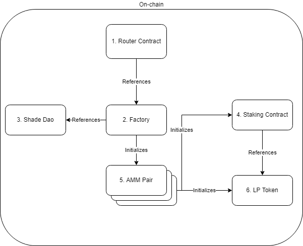
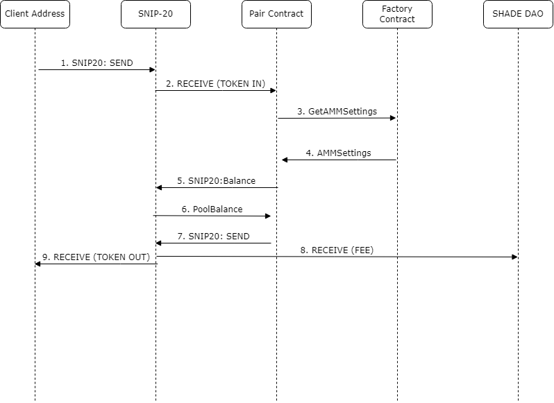
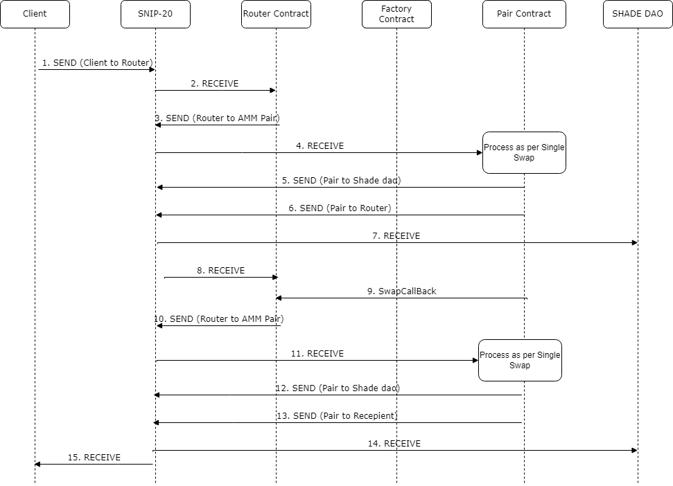

# Overview

Shadeswap is composed of three main areas

1. Smart Contracts
2. Backend Services
3. API Services

Note: These docs do not cover end-user client, mechanism to distribute rewards to staking contract

# Smart Contracts

## Architecture

The contract architecture of Shadeswap presumes that multiple pairs will be initialized and need to be in unison, therefore interdependency between Factory and AMM Pair contracts is required. Due to security reasons, if a new AMM Pair is to be introduced, a new Factory and Router will need to be initialized as code hashes are cross verified.

|Name|Description|
|-|-|
|Router|Used for multi-hop trades, should be considered stateless|
|Factory|Used to initailize and manage new pairs, lp tokens and staking contracts|
|AMM Pair|Used for trading one token for another. Supports Native and SNIP20 Compatible Tokens|
|Staking Contract|Used for staking LP Tokens for reward generation|
|LP Token|SNIP20 contract with slightly different constraints to allow for more verbose naming|
|Shade Dao|Contract to receive the fees generated from trades|

## Getting Started

To deploy the Shadeswap solution, have ready a SHADE DAO address, SNIP20 tokens to trade, Admin Address

1. Store all Shadeswap contracts
2. Initialize Factory Contract
3. Initialize Pairs to be traded
4. Initialize Router
5. Register SNIP20 tokens within Router

## Single Swap
### SNIP20

|Step Number|Description|
|-|-|
|1|Using the SNIP20 Receive extension, clients will issue a SNIP20 message to the SNIP20 Contract|
|2|The SNIP20 contract will call Receive on the AMM Pair Contract with embedded an invocation of SwapTokens which specifies the parameters of the desired swap|
|3|The Pair Contract will query the AMM Settings such as the fee amount from the Factory Contract|
|4|Factory Contract will return AMM Pair settings|
|5|The AMM Pair will query SNIP20 Contract the token pool balances to calculate pricing|
|6|The SNIP20 contract will return the pool balances|
|7|The Pair Contract will issue a send msg to the SNIP20 contract|
|8|If registered, the SNIP20 contract will call Receivee on the client address and SHADE DAO|

### Native

For starting with a native token, STEP 1 is skipped and clients will directly send to the AMM Pair contract a SwapTokens to the pair contract.

For ending with a native token, in step 7 a direct native send msg is issued instead of send via SNIP20 contract.

## Multi Swap

### SNIP20
|Step Number|Description|
|-|-|
|1|Using the SNIP20 Receive extension, clients will issue a SNIP20 message to the SNIP20 Contract|
|2|The SNIP20 contract will call Receive on the AMM Router Contract with embedded an invocation of SwapTokensForExact which specifies the parameters of the desired swap including paths|
|3|The Router Contract will issue a SNIP20 Send Message to the SNIP20 contract|
|4|The pair contract will receive the funds and make the swap as per the single swap process|
|5|The Pair Contract will issue a send msg to the SNIP20 contract|
|6|The Pair Contract will issue a send msg to the SNIP20 contract|
|7|If registered, the router contract receive is called|
|8|If registered, the SNIP20 contract will call received on the SHADE DAO|
|9|SwapCallback is called on router contract by the Pair Contract|
|10,11,12|Is duplicated for each leg in the trade|
|13| The recipient of the last trade is the original caller or a custom recipient in original invocation|
|14|If registered, the SNIP20 contract will call received on the client address and SHADE DAO|

### Native

Similar to single swap, the same differences in invocations are for multiple hop trades.

## Integration Tests

The swap process above is covered under the test run_testnet in network_integration.rs

# Audit Considerations

|Item #|Description|Comments|
|-|-|-|
|1|PRNG Seed is passed from Factory to all Pair Contracts||
|2|Pair Contracts require the Factory to make trades (as fees and shade dao information is managed centrally)||
|3|Cannot remove AMM Pair from Factory||
|4|LP Token is based on SNIP20 however the name will not conform to standard SNIP20 constraints i.e. Symbol length, token name and description.||
|5|Any path can be passed to the router contract even one not in the factory||
|6|If you update the pair_contract will it break compatibility between old and new pair contracts. All pair contracts must be on the same version (have same code hash as per defined in factory contract)||